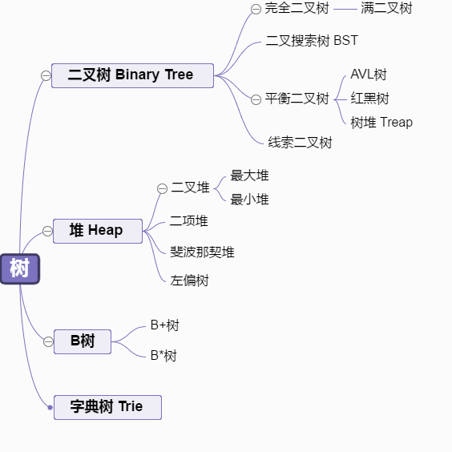

#### 二叉树

每个节点有两个子树,左子树和右子树;





##### 二叉树常用的性质
* 二叉树的第i层最多有2^(n-1)个节点
* 二叉树如果深度为k,那么这颗树最多有2^(k-1)个节点
* 二叉树分类:满二叉树,完全二叉树


##### 满二叉树和完全二叉树

* 满二叉树:满足节点数为2^(k-1),(说白了就是整棵树没有节点为空)
* 完全二叉树:若二叉树的深度为h,满足(0~h-1)层二叉树的节点都达到最大个数,并且第h层的节点都集中在最左侧


##### 其他名词
- 树的深度:树中最大节点层
- 结点的度:结点子树的个数
- 叶子结点:是度为0的结点
##### 二叉树的遍历

* 前序遍历:根节点 -> 左子树  -> 右子树
* 中序遍历:左子树 -> 根节点  -> 右子树
* 后序遍历:左子树 -> 右子树  -> 根节点


其中遍历方式又分为,递归遍历&非递归遍历

```
//定义一颗二叉树
type TreeNode struct {
	Val   int
	Left  *TreeNode
	Right *TreeNode
}

// 前序遍历二叉树
func preorder(node *TreeNode) {
	fmt.Println(node.Val)
	if node.Left != nil {
		preorder(node.Left)
	}
	if node.Right != nil {
		preorder(node.Right)
	}
}

// 中序遍历二叉树
func inorder(node *TreeNode) {
	if node.Left != nil {
		inorder(node.Left)
	}
	fmt.Println(node.Val)
	if node.Right != nil {
		inorder(node.Right)
	}
}

// 后序遍历二叉树
func posorder(node *TreeNode) {
	if node.Left != nil {
		posorder(node.Left)
	}
	if node.Right != nil {
		posorder(node.Right)
	}
	fmt.Println(node.Val)
}

层次遍历二叉树
func levelTree(root *TreeNode) []int {
	var result []int
	queue := []*TreeNode{root}

	for len(queue) > 0 {
		root = queue[0]
		queue = queue[1:]
		result = append(result, root.Val)
		// 先把 Right 边的节点放入 queue 才能保证
		// 最后剩下的 root 是 bottom left
		if root.Right != nil {
			queue = append(queue, root.Right)
		}
		if root.Left != nil {
			queue = append(queue, root.Left)
		}
	}

	return result
}

```
##### 二叉树的深度(递归&非递归)
递归版本
```
func getTreeDepthRecursion(node *TreeNode) int {
	if node == nil {
		return 0
	}
	left := getTreeDepthRecursion(node.Left)
	right := getTreeDepthRecursion(node.Right)
	return int(math.Max(float64(left), float64(right))) + 1
}

```
非递归版本
```
func getTreeDepthNonRecursion(root *TreeNode) int {
	// 层序遍历求深度
	queue := make([]*TreeNode, 1, 1024)
	queue[0] = root
	n := 1
	level := 1
	if len(queue) > 0 {
		n--
		node := queue[0]
		queue = queue[1:]
		if node.Left != nil {
			queue = append(queue, node.Left)
		}
		if node.Right != nil {
			queue = append(queue, node.Right)
		}
		if n == 0 {
			level++
		}

	}
	return level
}

```


##### 平衡二叉树(`AVL`)
定义:父节点的左子树和右子树高度只差不能大于1,并且左右两颗子树都是一颗平衡二叉树


#### 如何构建一颗二叉树


#### 二叉树相关算法

* 判断一棵二叉树是不是另一颗的子树   


