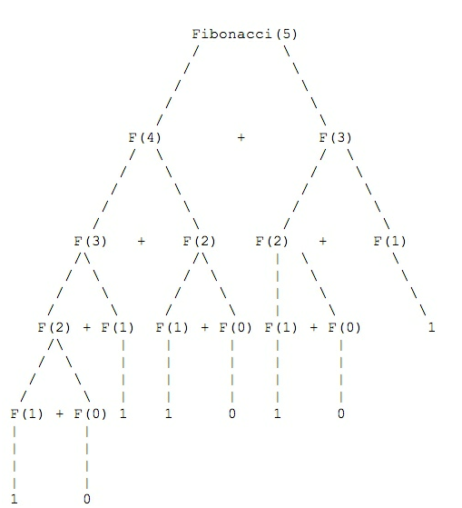

##### 递归的执行过程


背景:记得上学的时候学习数据结构和算法,学过递归,当时也学明白了,但是到了工作之后,
逐渐忘记了,而且有的时候刷算法题因为理解的不是特别透彻会拒绝使用递归相关的算法,今日开始复习下递归的处理流程


一个非递归的例子来求5!(golang)
```
func factorialV2(num int) int {
	sum := 1
	for i := 1; i <= num; i++ {
		sum = sum * i
	}
	return sum
}
```
对于非递归的例子来说,显而易见,不就是依次相乘,非常容易理解,但是对于递归的,我们可以思考一下~


一个例子,通过递归来求5!(golang)

```
func factorial(num int) int {
	if num == 1 {
		return 1
	}
	return num * factorial(num-1)
}

```

对于这个阶乘的执行过程如下:
```
factorial(5)   =  5 * factorial(4)
factorial(5)   =  5 *(4 * factorial(3))
...

factorial(1)   =  5 *(4*(3*(2 * factorial(1))))   //那么对于这个递归的最后执行顺序为这样

当num = 1 的时候,开始计算
```


##### 斐波那契
斐波那契递归实现
```
func fibonacci(num int) int {
	if num < 2 {
		return 1
	}
	return fibonacci(num-1) + fibonacci(num-2)
}
```

